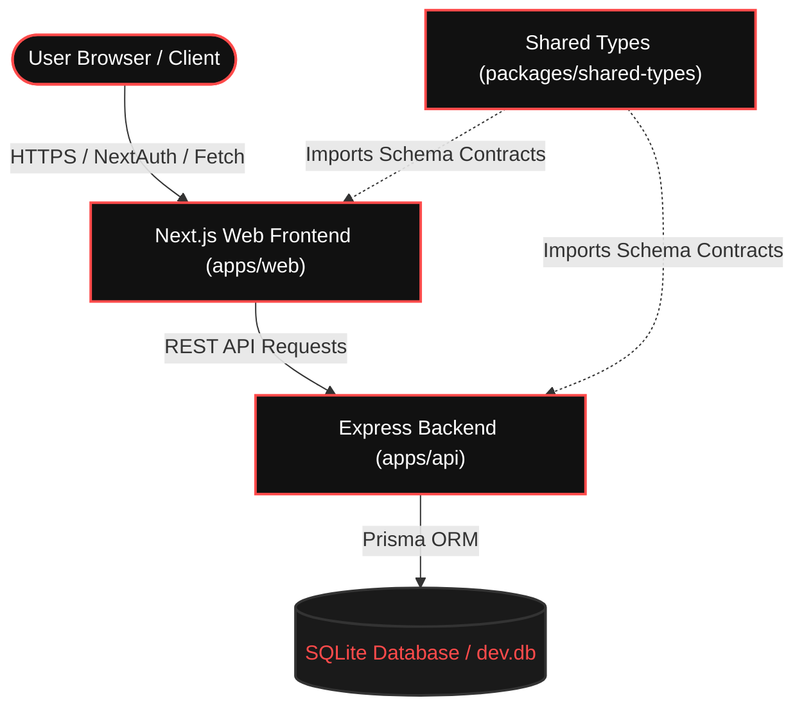
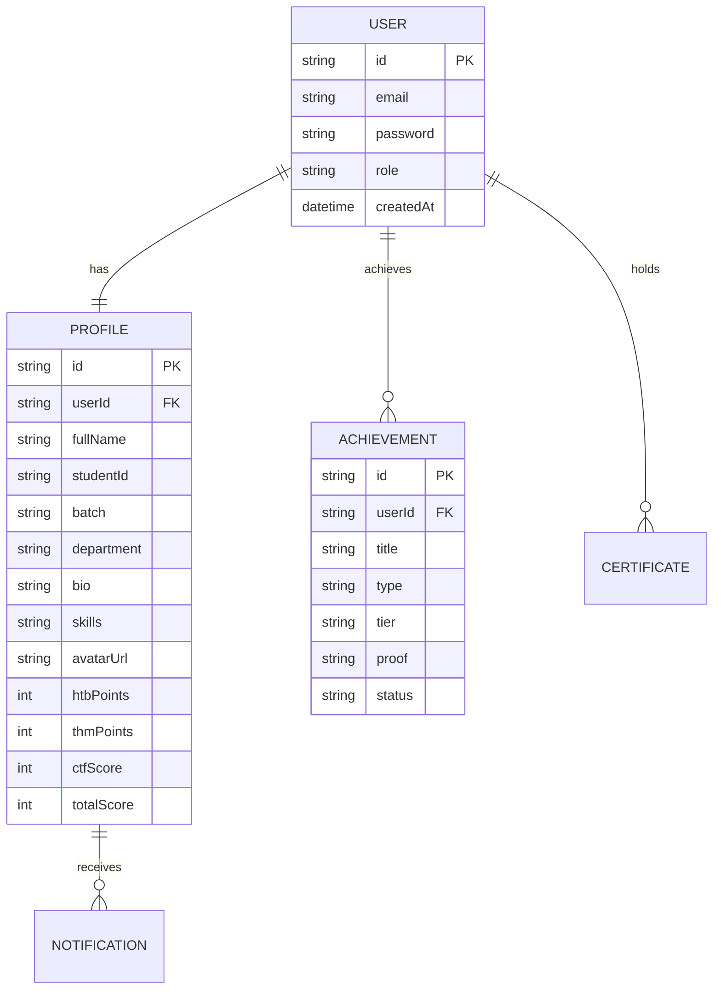

# DIU Cyber Security Center (CSC) — Platform Technical Documentation
**Version**: 1.0.0  
**Authors**: DIU CSC Engineering Team  
**Status**: Ready for Production Presentation  

---

## 1. Executive Summary

The **DIU Cyber Security Center (CSC)** platform is a specialized web application engineered for Daffodil International University. It aims to centralize student profiling, verify ethical hacking achievements, broadcast security training events, host student research blogs (Threat Intel), maintain a competitive scoreboard leaderboard, and provide a digital verification ledger for certifications.

The system is designed with a **monorepo architecture** that isolates the user-facing frontend from the data-processing backend, ensuring clean separation of concerns, rapid development cycles, and high modularity.

---

## 2. System Architecture & Tech Stack

The platform is designed around a monorepo structure consisting of three isolated workspaces managed via npm workspaces:



### Core Technologies
*   **Frontend**: Next.js 16 (Turbopack compiler), React, TailwindCSS, Lucide React, NextAuth.js.
*   **Backend**: Node.js, Express.js, TypeScript.
*   **Database & ORM**: Prisma ORM, SQLite (`dev.db` for testing/local execution) with seamless migration capabilities to PostgreSQL.

---

## 3. Directory Layout

The workspace files are categorized as follows:

```
diu-cyber-security-center/
├── apps/
│   ├── web/                    # Next.js Frontend Application
│   │   ├── app/                # Next.js App Router (Layouts & Pages)
│   │   ├── components/         # Reusable UI Elements (Navbar, Footer, Effects)
│   │   ├── public/             # Static Assets (CSC Logo, icons)
│   │   └── lib/                # API wrappers & Authentication configurations
│   └── api/                    # Express.js REST API Backend
│       ├── src/
│       │   ├── routes/         # API Routers (Auth, Profiles, Leaderboard)
│       │   ├── middleware/     # Auth & Role-Based Access Control (RBAC)
│       │   └── server.ts       # API Server Bootstrapper
│       └── prisma/             # Schema definitions and database seed scripts
├── packages/
│   └── shared-types/           # Common TypeScript types shared between web and api
├── package.json                # Monorepo Workspace Configuration
└── vercel.json                 # Vercel Monorepo Deployment Configuration
```

---

## 4. Database Schema & Data Models

The data layer is managed via Prisma. The following entity relationships form the core database schema:



### Main Entities Detailed
1.  **User**: Handles authentication and holds authorization roles.
2.  **Profile**: Contains biographical and academic details, and tracks cybersecurity points from external platforms (Hack The Box, TryHackMe, and internal CTF events).
3.  **Achievement**: Registry of submitted hackathon wins, bug bounty rewards, or verified certifications.
4.  **Certificate**: Verification records that can be public-checked via unique hash values.

---

## 5. Security & Access Control (RBAC)

The system enforces strict **Role-Based Access Control (RBAC)** across four clearance levels to secure dashboards and admin actions:

| Role | Access Level | Description |
| :--- | :--- | :--- |
| **`STUDENT`** | Student Trainee | View roadmaps, edit digital ID cards, submit achievements for review, check scoreboard. |
| **`TEACHER`** | Faculty Advisor | Verify student achievements, upload academic resource paths, review lab audits. |
| **`ADMIN`** | Lab Administrator | Approve user registrations, edit notice boards, schedule workshops/CTF events. |
| **`SUPER_ADMIN`**| Platform Owner | Modify system configurations, audit server security logs, adjust platform roles. |

### API Protection Example:
```typescript
// Middleware inside apps/api/src/middleware/rbac.ts
export const requireRole = (allowedRoles: string[]) => {
  return (req: Request, res: Response, next: NextFunction) => {
    const userRole = req.user?.role;
    if (!userRole || !allowedRoles.includes(userRole)) {
      return res.status(403).json({ error: "Access Denied: Insufficient security clearance." });
    }
    next();
  };
};
```

---

## 6. Scoreboard Algorithm

The student rankings displayed on the homepage and `/leaderboard` are compiled automatically based on active scores. The score is computed as follows:

$$\text{Total Score} = \text{HTB Points} + \text{THM Points} + \text{CTF Score}$$

Based on the total score, analysts are grouped into competitive tiers:
*   🏆 **PLATINUM**: $\ge 700 \text{ points}$
*   🥇 **GOLD**: $300 - 699 \text{ points}$
*   🥈 **SILVER**: $100 - 299 \text{ points}$
*   🥉 **BRONZE**: $0 - 99 \text{ points}$

---

## 7. Frontend Deployment Configuration

The frontend is optimized for serverless execution on **Vercel** with a workspace boundary config:

### Vercel Deployment File (`vercel.json`)
```json
{
  "buildCommand": "npm run build -w @csc-diu/api && npm run build -w web",
  "outputDirectory": "apps/web/.next",
  "framework": "nextjs"
}
```
*   **Prerequisites**: Runs a build on `@csc-diu/api` first to generate the Prisma client before building the Next.js production files in Turbopack mode.
*   **Monorepo Support**: `.npmrc` is configured with `legacy-peer-deps=true` to resolve Next.js 16/Next Auth integration conflicts seamlessly.

---

## 8. Mobile Responsiveness Implementation

To guarantee a clean layout on all viewports, the platform implements:
*   **Opaque Menu Overlays**: The mobile navigation drawer uses a solid `#0D0D0D` backdrop blur layout to prevent content overlapping on smaller mobile screen dimensions.
*   **Adaptive Grid Containers**: Columns collapse from `grid-cols-4` on desktops to `grid-cols-1` on screens below `640px`.
*   **Scrollable Data Tables**: Main scoreboard lists enforce `min-w-[700px]` with outer `overflow-x-auto` wrappers to enable horizontal swipe actions on mobile devices instead of squeezing text columns.

---

## 9. Future Roadmap & Cloud Migration Plan

To fully deploy the production application:
1.  **Migrate SQLite to Cloud PostgreSQL**:
    *   Initialize a free Postgres node on **Supabase** or **Neon**.
    *   Change database provider in `schema.prisma` from `sqlite` to `postgresql`.
    *   Deploy migrations with `npx prisma db push`.
2.  **Deploy Backend API to Render/Railway**:
    *   Deploy `apps/api` Node server to Render (Free Web Service) or Railway.
    *   Bind the API environment variables (`DATABASE_URL` and `JWT_SECRET`).
3.  **Link Vercel Frontend**:
    *   Add `NEXT_PUBLIC_API_URL` to Vercel environment variables pointing to the live API backend url.
